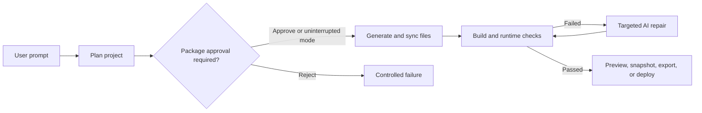

# Website Builder Agent

A full-stack AI website builder powered by LangGraph. It generates multi-file Tailwind React projects, validates them with production and browser checks, automatically repairs failures, and supports durable checkpoint-based execution with human approval for protected actions.

## Key Features

- **Durable LangGraph workflows** with SQLite checkpoints, interrupts, and process-safe resume.
- **Multi-file website generation** using Vite, React, TypeScript, and Tailwind CSS 4.
- **Automated repair loop** driven by TypeScript, production-build, dependency, and browser-runtime diagnostics.
- **Human-in-the-loop controls** for package installation, large AI edits, and deployment actions.
- **Browser IDE workflow** with Monaco Editor, WebContainer preview, snapshots, diff review, export, and verification-gated deployment.

## Architecture



## Tech Stack

| Layer | Technology |
| --- | --- |
| Frontend | Next.js App Router, React, TypeScript, Tailwind CSS, Radix UI |
| Editor and preview | Monaco Editor, WebContainer API, xterm.js |
| Backend | FastAPI, Pydantic, Uvicorn |
| AI agent | LangGraph, LangChain, OpenAI |
| Generated apps | Vite, React, TypeScript, Tailwind CSS 4 |
| Verification | Vite production build, TypeScript diagnostics, Playwright runtime smoke tests |
| Export and deploy | ZIP export, GitHub API, Vercel, Netlify, Cloudflare Pages |

## Quick Start

### Backend

```powershell
cd backend
python -m venv .venv
.\.venv\Scripts\Activate.ps1
pip install -r requirements.txt
Copy-Item .env.example .env
uvicorn app.main:app --reload
```

Backend API docs are available at http://127.0.0.1:8000/docs.

### Frontend

```powershell
cd frontend
npm install
Copy-Item .env.example .env.local
npm run dev
```

Frontend dev server: http://localhost:3000

## Configuration

`OPENAI_API_KEY` is required for generation and AI editing. Deployment credentials are optional and only needed for their matching providers. See `backend/.env.example` and `frontend/.env.example` for the complete configuration template.

## Verification

Frontend:

```powershell
cd frontend
npm run lint
npm run build
```

Backend:

```powershell
cd backend
pip install -r requirements.txt
python -m pytest
```

## Durable Agent Demo

Disable **Uninterrupted AI Actions**, then request a website that needs an additional npm package. The graph pauses at a LangGraph interrupt and displays the approval request inside Preview.

To demonstrate durability, restart the backend before approving. The run resumes from its SQLite checkpoint instead of starting over. Build and runtime repairs remain automatic.

## Documentation

See [docs/architecture.md](docs/architecture.md) for graph topology, persistence, workspace boundaries, verification, and deployment design.
