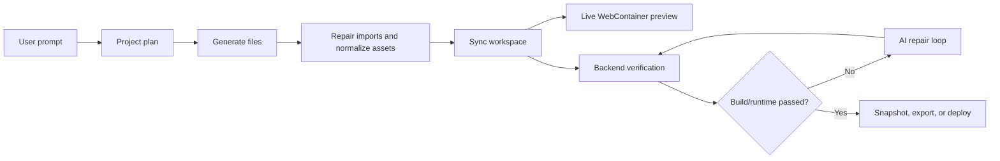

# website-builder-agent

AI-powered website builder and browser-based IDE for generating, editing, verifying, and exporting Vite React websites.

This project is a full-stack AI agent application. Users describe the website they want, review a generated file plan, preview the result in a live WebContainer environment, edit files in Monaco, and export or deploy the finished project. Production and browser checks run automatically after generated changes without blocking the live preview.

## Highlights

- **Agentic website generation**: LangGraph workflow plans files, generates code, repairs missing imports, syncs sources, runs production builds, performs runtime smoke checks, and attempts targeted fixes.
- **Live browser IDE**: Next.js app with Monaco Editor, file tree management, WebContainer live preview, terminal history, and project switching.
- **Diff-based AI editing**: Existing projects can be edited through preview/apply flows with change-size classification and large-change confirmation.
- **Verification loop**: Backend build and runtime diagnostics capture TypeScript errors, runtime errors, warnings, changed files, and repair notes.
- **Project lifecycle tools**: Snapshot history, restore, compare, ZIP export, GitHub export, and verification-gated deploy actions.
- **Portfolio-ready architecture**: Separate frontend, backend, generated workspace, Vite template, schemas, services, and agent graph modules.

## Tech Stack

| Layer | Technology |
| --- | --- |
| Frontend | Next.js App Router, React, TypeScript, Tailwind CSS, Radix UI |
| Editor and preview | Monaco Editor, WebContainer API, xterm.js |
| Backend | FastAPI, Pydantic, Uvicorn |
| AI agent | LangGraph, LangChain, OpenAI |
| Generated apps | Vite, React, TypeScript |
| Verification | Vite production build, TypeScript diagnostics, Playwright runtime smoke tests |
| Export and deploy | ZIP export, GitHub API, Vercel, Netlify, Cloudflare Pages |

## Product Flow



## Repository Structure

```text
website-builder-agent/
|-- README.md
|-- docs/
|   `-- architecture.md
|-- frontend/                 # Next.js app and browser IDE
|   |-- app/
|   |-- components/
|   `-- lib/
|-- backend/                  # FastAPI API, agent workflows, services, schemas
|   |-- app/
|   |   |-- agents/
|   |   |-- api/routes/
|   |   |-- schemas/
|   |   `-- services/
|   |-- templates/
|   |   `-- vite-react-ts/
|   `-- tests/
`-- workspace/                # Generated projects, ignored by git
```

## Getting Started

### 1. Backend

```powershell
cd backend
python -m venv .venv
.\.venv\Scripts\Activate.ps1
pip install -r requirements.txt
uvicorn app.main:app --reload
```

Backend API docs are available at http://127.0.0.1:8000/docs.

### 2. Frontend

```powershell
cd frontend
npm install
npm run dev
```

Frontend dev server: http://localhost:3000

## Environment Variables

Create `backend/.env` for local secrets:

```env
OPENAI_API_KEY=...
OPENAI_MODEL=gpt-5.4-mini
OPENAI_FIX_MODEL=gpt-5.3-codex
APP_BASE_URL=http://127.0.0.1:8000

GITHUB_TOKEN=...
VERCEL_TOKEN=...
NETLIFY_TOKEN=...
CLOUDFLARE_API_TOKEN=...
CLOUDFLARE_ACCOUNT_ID=...
```

Only `OPENAI_API_KEY` is required for AI generation and editing. Deployment variables are optional and only needed for the matching provider.

## Verification

Frontend:

```powershell
cd frontend
npm run lint
npm run build
```

Backend:

```powershell
cd backend
pip install -r requirements.txt
python -m pytest
```

## Resume Summary

Built a full-stack AI website builder with Next.js, FastAPI, LangGraph, OpenAI, Monaco Editor, and WebContainer live preview. Designed an agent workflow that plans, generates, verifies, and auto-repairs Vite React projects using TypeScript, build, and runtime diagnostics. Added project persistence, version snapshots, diff-based AI edits, export/deploy integrations, and verification-gated deployment.

## Current Limitations

- The frontend app currently contains a large top-level page component; splitting it into focused panels and hooks would improve maintainability.
- Automated backend coverage is still early and should be expanded around workspace safety, agent repair validation, diagnostics parsing, and deploy providers.
- AI generation quality depends on configured model behavior and available OpenAI API access.
- Deploy integrations require provider tokens and have not been abstracted behind a mockable provider interface yet.
