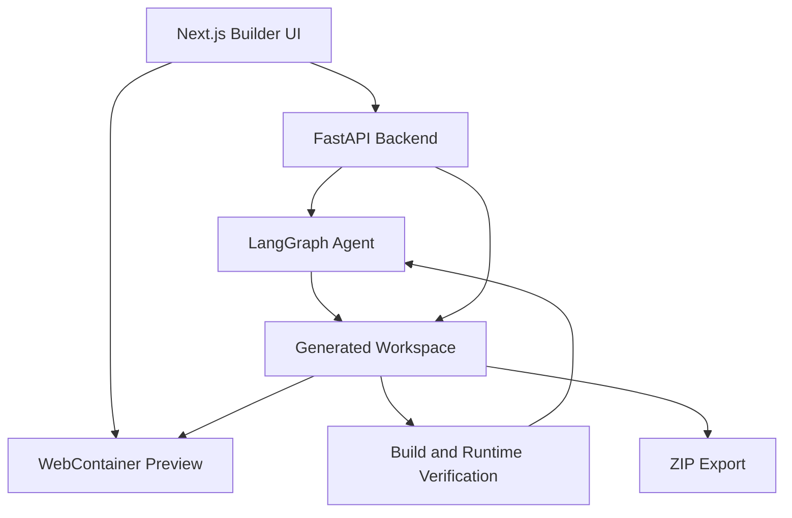
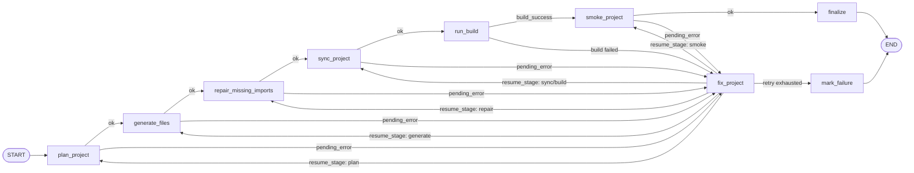
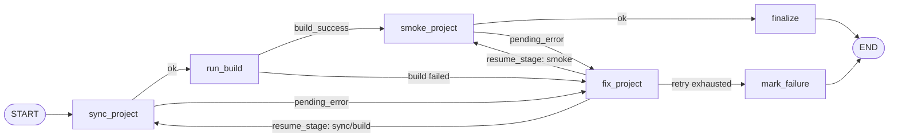
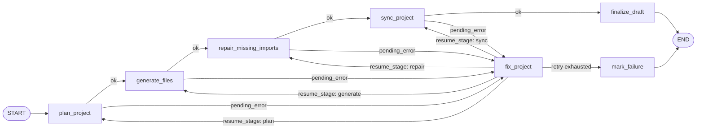
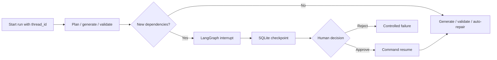

# Architecture

`website-builder-agent` is organized around one core loop: turn a user request into a working Vite React project, show it immediately in the browser, and keep verification feedback close enough that the generated app can be repaired and exported.

## System Overview

## Frontend

The frontend is a browser IDE built with Next.js and TypeScript. It manages guided prompting, project selection, file browsing, Monaco-based editing, live preview, diagnostics, history, and ZIP export.

Important modules:

- `frontend/app/page.tsx`: main builder workflow and UI orchestration.
- `frontend/lib/api.ts`: typed API client for backend operations.
- `frontend/lib/webcontainer/runtime.ts`: WebContainer boot, file sync, and live preview runtime.
- `frontend/components/TerminalPanel.tsx`: project terminal history and package install actions.
- `frontend/components/HistoryPanel.tsx`: snapshots, restore, and compare UI.
- `frontend/components/ExportPanel.tsx`: workspace and verified production ZIP controls.

## Backend

The backend exposes project, diagnostics, snapshot, quality, terminal, variant, and export APIs. It also owns filesystem safety for generated projects under `workspace/`.

Important modules:

- `backend/app/main.py`: FastAPI application and route registration.
- `backend/app/agents/workflows.py`: LangGraph topology and conditional edge assembly.
- `backend/app/agents/routing.py`: retry-budget and resume-stage routing decisions.
- `backend/app/agents/approval.py`: dependency approval interrupts and repair checkpoint compatibility.
- `backend/app/agents/checkpoint.py`: durable SQLite checkpointer configuration.
- `backend/app/api/routes/projects.py`: project creation, chat, draft generation, verification, file CRUD, edit preview/apply, and preview serving.
- `backend/app/services/workspace.py`: project ID validation, safe path validation, metadata, and project file operations.
- `backend/app/services/build.py`: Vite build execution and source normalization.
- `backend/app/services/runtime_smoke.py`: Playwright smoke test against generated builds.
- `backend/app/services/export.py`: workspace and production-build ZIP creation.

## Agent Workflow

The agent graph lives in `backend/app/agents/graph.py`. The main generation graph follows this sequence:

1. **Plan**: produce a bounded file plan for a Vite React TypeScript website.
2. **Generate**: create source, data, CSS, and asset files.
3. **Repair imports**: detect missing local imports and generate placeholders when possible.
4. **Sync**: write generated files into the project workspace.
5. **Build**: run production verification.
6. **Smoke test**: run browser runtime checks against the generated app.
7. **Fix**: request targeted patches when dependency, build, or runtime failures are detected.
8. **Finalize**: return files, warnings, build logs, and repair metadata.

The graph is not a single linear chain. Each stage routes through `_route_if_pending`, so dependency, generation, build, and runtime failures can move into `fix_project`. After a fix attempt, `_route_after_fix` sends execution back to the stage that can validate the patch. If retry limits, invalid fix limits, or stale-fix limits are reached, the graph exits through `mark_failure`.

### Edit Graph

The edit graph reuses the same verification and repair path, but starts from existing project files and applies full-file patches generated by the edit service before entering LangGraph.

### Draft Graph

The draft graph powers new-site requests through `POST /api/projects/{project_id}/chat/draft`. It favors fast live preview by planning, generating, repairing imports, and syncing files. After the preview is synchronized, the frontend starts backend validation without blocking the user. Validation runs a production build and a browser runtime smoke test, applies targeted repairs when either stage fails, and returns all repair changes to the live preview in one final batch. Draft edits still use the edit-draft patch path because they start from existing project files and need diff-oriented patch handling.

### Node Routing Summary

| Graph | Entry | Verification | Repair loop | Exit |
| --- | --- | --- | --- | --- |
| `website_builder_graph` | `plan_project` | production build and runtime smoke test | returns to `plan`, `generate`, `repair`, `sync`, or `smoke` based on `resume_stage` | `finalize` or `mark_failure` |
| `website_edit_graph` | `sync_project` | production build and runtime smoke test | returns to `sync` or `smoke` | `finalize` or `mark_failure` |
| `website_draft_graph` | `plan_project` | production build and browser smoke validation start after preview sync | returns to `plan`, `generate`, `repair`, or `sync`; the validation service owns later build/runtime repairs | `finalize_draft` or `mark_failure` |

## Data Boundaries

- `workspace/` is generated runtime data and should not be committed.
- `backend/templates/vite-react-ts/` is the clean Tailwind CSS 4 + Vite project template copied for each new generated project.
- `backend/.env` stores local secrets and must stay untracked.
- Diagnostics, snapshots, and history are stored per project under the generated workspace.
- LangGraph checkpoints are stored in `workspace/.builder/langgraph-checkpoints.sqlite3`; a unique agent `run_id` is used as the checkpoint `thread_id`.

## Durable Runs and Human Review

The main Ask AI generation flow executes the complete generation or edit graph with checkpointing and targeted human review. Uninterrupted mode lets package installation and repair proceed automatically. When that mode is disabled, package installation pauses the agent and replaces the Preview loading state with an approval card; ordinary build and runtime repairs remain automatic:

Because the graph is compiled with a durable checkpointer, the API can reload an interrupted run and resume it with the same `run_id` after the backend process restarts. The Jobs tab is reserved for background-job history.

## Reliability Strategy

- Backend schemas use Pydantic response models to keep API contracts explicit.
- Project IDs and editable paths are validated before filesystem operations.
- Build failures are parsed into TypeScript diagnostics and summarized for repair prompts.
- Runtime smoke checks catch browser-only errors that TypeScript cannot see.
- Large AI edit previews require confirmation before apply.
